  

<!--

-->

  <h3>💡 <i>"Data is the new soil. So let's get our hands dirty and dig deep. 🪏 Shall we?"</i> 📊🌱🌿</h3>
   

---

## 📧 Contact me
  <!-- Kapcsolati gombok -->
<table align="center" width="100%">
<tr>
<td align="center" style="padding: 30px;">
  
  

</td>
</tr>
</table>

## 🛠️ Tech Stack

**Languages**

**Data & Processing**

**Tooling & Infrastructure**

---

  <h3>🌟 Explore My Starred Repositories</h3>
  
Feel free to browse my starred collection! I regularly save and curate awesome open-source projects across various domains.

  
  
  
  
  
    

  

---

## 📱 Mit tudok fejleszteni mobilról?

A **Claude Code** webes felületén (`claude.ai/code`) mobiltelefonról is teljes fejlesztési munkát végezhetek — a kód egy távoli felhős konténerben fut, én csak a böngészőn keresztül irányítom.

| Kategória | Mit lehet csinálni? |
|---|---|
| **Kód írás & szerkesztés** | Python szkriptek, SQL lekérdezések, konfigurációs fájlok |
| **Adattudomány** | ML modellek, adat-pipeline-ok, EDA szkriptek |
| **Shell parancsok** | Fájlkezelés, csomagtelepítés, tesztek futtatása |
| **Git műveletek** | Commit, push, branch kezelés GitHub-ra |
| **API fejlesztés** | REST végpontok, Claude API integráció |
| **Dokumentáció** | README frissítés, technikai leírások |

> 🚀 **Ez a szekció is mobilról készült** — Claude Code segítségével, a `claude/mobile-dev-capabilities-fnhgd6` branchen.

---

